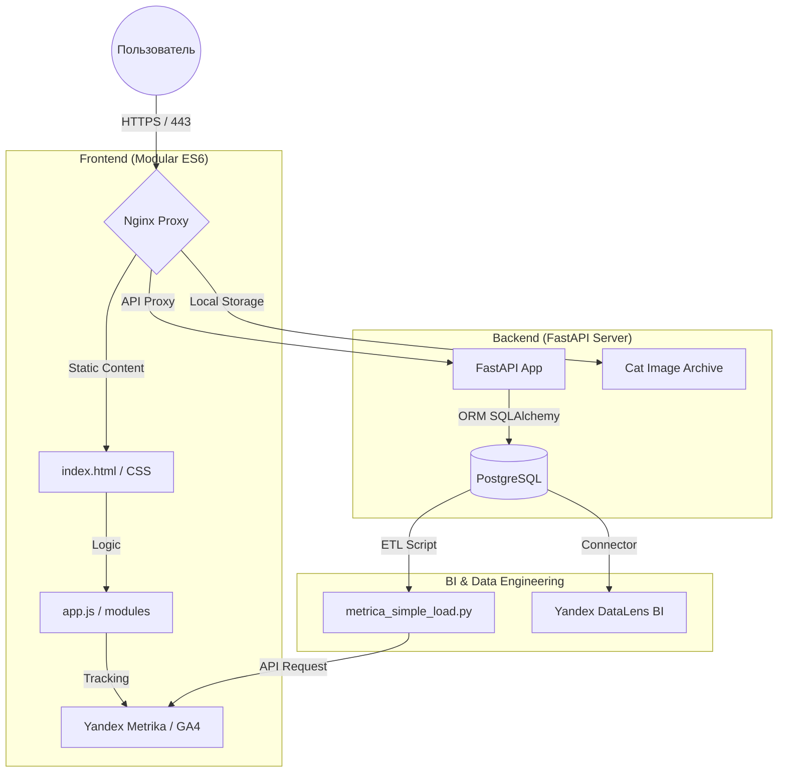

# 🐾 Gachapets: Fullstack Analytics & Gacha System

  

  <a href="https://gachapets.ru"><strong>🚀 Live Demo</strong></a> | 
  <a href="https://datalens.yandex/m3m1tdjsuzx86"><strong>📊 Live BI Dashboard</strong></a>

  
  
  
  
  

---

## 🌟 О проекте

**Gachapets** — это интерактивная Fullstack-платформа, объединяющая игровую механику "Гача" с профессиональной системой сквозной аналитики. Проект демонстрирует полный цикл разработки: от создания модульного фронтенда до настройки ETL-пайплайнов и построения BI-дашбордов.

### 🎯 Ключевые фичи
- **Smart Pity System:** Алгоритм "защиты от неудач" — гарантированный легендарный дроп на 20-й призыв внутри сессии.
- **End-to-End Analytics:** Сквозная связка данных из PostgreSQL и Yandex.Metrica API по уникальному `user_uuid`.
- **Traffic Attribution:** Система отслеживания источников трафика через кастомные URL-метки (`?ref=tg`) с записью в БД.
- **Automated ETL:** Python-скрипты на базе `Pandas` для ежедневной выгрузки, дедупликации и сессионизации данных по расписанию (Cron).
- **High-Performance Static:** Оптимизированная раздача медиа-контента напрямую через Nginx.

---

## 🏗 Архитектура системы

erDiagram
    USERS ||--o{ SUMMONS : "performs"
    USERS ||--o{ UI_EVENTS : "triggers"

    USERS {
        string user_uuid PK "Unique Identity"
        datetime first_seen "Registration Date"
        string referrer "Source (tg, direct, etc)"
        boolean is_mobile "Device Type"
    }

    SUMMONS {
        int id PK
        string user_uuid FK "User Link"
        string session_id "Session tracking"
        string cat_title "Character Name"
        string rarity "Tier"
        datetime timestamp "Event Time"
    }

    UI_EVENTS {
        int id PK
        string user_uuid FK "User Link"
        string event_name "Action (open_info, etc)"
        datetime timestamp "Event Time"
    }
