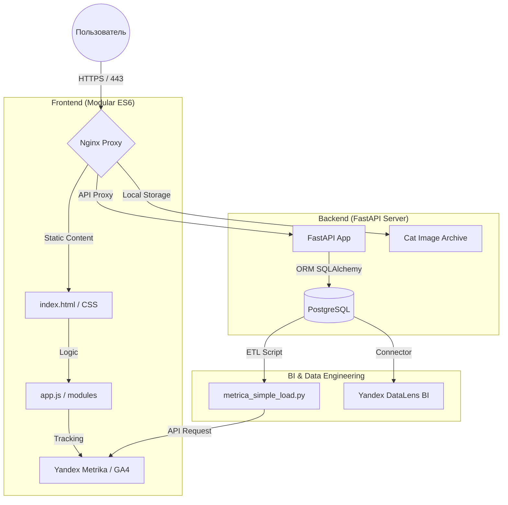
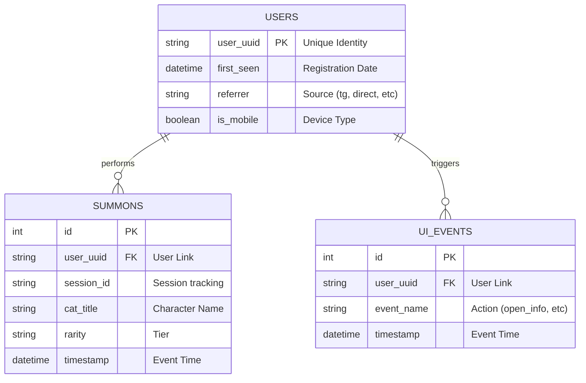

## 🏗 Архитектура системы

```mermaid
graph TD
    User((Пользователь)) -->|HTTPS / 443| Nginx{Nginx Proxy}
    
    subgraph "Frontend (Modular ES6)"
        Nginx -->|Static Content| HTML[index.html / CSS]
        HTML -->|Logic| JS[app.js / modules]
        JS -->|Tracking| YM[Yandex Metrika / GA4]
    end

    subgraph "Backend (FastAPI Server)"
        Nginx -->|API Proxy| FastAPI[FastAPI App]
        FastAPI -->|ORM SQLAlchemy| DB[(PostgreSQL)]
        Nginx -->|Local Storage| Disk[Cat Image Archive]
    end

    subgraph "BI & Data Engineering"
        DB -->|ETL Script| Python[metrica_simple_load.py]
        Python -->|API Request| YM
        DB -->|Connector| DataLens[Yandex DataLens BI]
    end
```

## 📊 Модель данных (Relational Star Schema)  
### Реализована структура из трех связанных таблиц для глубокого анализа пользовательского пути.  

```mermaid
erDiagram
    USERS ||--o{ SUMMONS : "performs"
    USERS ||--o{ UI_EVENTS : "triggers"

    USERS {
        string user_uuid PK "Unique Identity"
        datetime first_seen "Registration Date"
        string referrer "Source (tg, direct, etc)"
        boolean is_mobile "Device Type"
    }

    SUMMONS {
        int id PK
        string user_uuid FK "User Link"
        string session_id "Session tracking"
        string cat_title "Character Name"
        string rarity "Tier"
        datetime timestamp "Event Time"
    }

    UI_EVENTS {
        int id PK
        string user_uuid FK "User Link"
        string event_name "Action (open_info, etc)"
        datetime timestamp "Event Time"
    }
```
