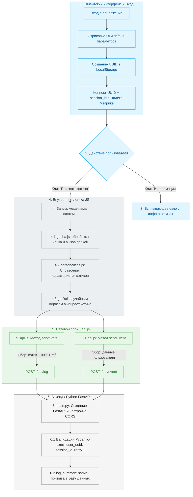

# Архитектура действий и сценарии приложения Gachapets

Документация описывает полный цикл взаимодействия пользователя с приложением: от инициализации сессии до валидации данных на бэкенде и сохранения логов в базу данных.

---

## 📊 Архитектурная схема (User Flow Diagram)

---

## 📝 Детальное описание сценария

### 1. Инициализация и вход
* **Вход в систему:** Пользователь открывает клиентскую часть приложения.
* **Интерфейс:** Происходит отрисовка пользовательского интерфейса (UI) с первичными параметрами по умолчанию (`default-параметры`).
* **Идентификация:** В `local-storage` браузера генерируется и сохраняется уникальный идентификатор пользователя (**UUID**).
* **Аналитика:** Подключается **Яндекс.Метрика**, которая связывает созданный `user_uuid` с текущим `session_id` для сквозной аналитики сессии.

### 2. Доступные действия на главном экране
Пользователю доступны две основные интерактивные кнопки:
* ℹ️ **«Информация»** — открывает справочный раздел.
* 🐾 **«Призвать котика»** — запускает основную игровую механику.

### 3. Ветка «Информация»
* При нажатии на кнопку «Информация» поверх основного экрана всплывает модальное окно, содержащее описание, правила и данные о доступных котиках.

### 4. Ветка «Призвать котика» (Игровая механика)
Нажатие кнопки активирует внутренние модули фронтенда:
* **Обработка клика:** В файле `gacha.js` перехватывается событие нажатия и вызывается метод `getRoll()`.
* **Справочник сущностей:** В файле `personalities.js` хранится коллекция (массив объектов), где каждый элемент описывает характеристики конкретного котика в формате `ключ : значение`.
* **Рандомизация:** Метод `getRoll()` обращается к этой коллекции и случайным образом выбирает одного котика.

### 5. Сетевой слой и отправка метрик (`api.js`)
После генерации котика клиент отправляет данные на сервер двумя параллельными POST-запросами:
* **Логирование призыва (`sendStats`):** 
  * Собирает: информацию о созданном котике, `user_uuid` из local-storage и `ref-метку` (реферер ссылки, по которой пришел пользователь).
  * Маршрут отправки: `POST ${приложение}/api/log`.
* **Логирование пользователя (`sendEvent`):**
  * Собирает: исключительно технические и сессионные данные о самом пользователе.
  * Маршрут отправки: `POST ${приложение}/api/event`.

### 6. Серверная часть (Бэкенд на Python / FastAPI)
Точка входа бэкенда описана в файле `main.py` и выполняет следующие задачи:
* **Конфигурация:** Создается экземпляр **FastAPI** приложения и настраиваются правила **CORS** для безопасного взаимодействия с клиентом.
* **Валидация бизнес-логики:** Проверяются списки разрешенных значений для категорий котиков, их уровней редкости и типов событий.
* **Схемы данных:** Входящие запросы проходят строгую валидацию на соответствие DTO-схемам. Проверяются поля:
  * `user_uuid`
  * `session_id`
  * `rarity`
  * `referrer`
  * `user_agent`
  * `oi_mobile`
* **Сохранение в БД:** Метод `log_summon()` принимает валидированные данные из роута `/api/log` и осуществляет конечную запись события вызова в базу данных.
